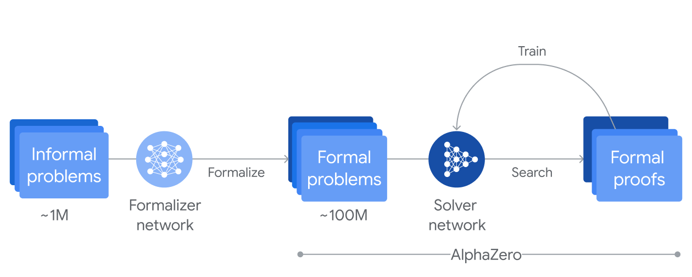
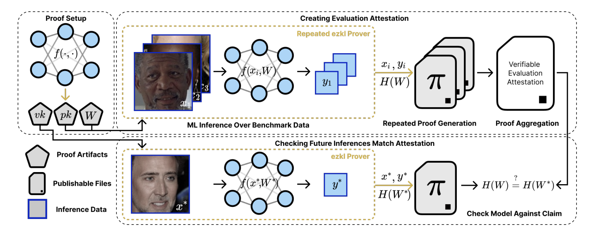

---  
title: "AI alignment through programmable cryptography"
date: "2025-05-12T09:27:45.934Z"  
description: "A brief note on how verifiable computation is essential for future AI systems"
---
*Special thanks to Julie for feedback*

## Introduction
Recently, there have been significant advances both in [programmable cryptography](https://0xparc.org/blog/programmable-cryptography-1) and [AI](https://ourworldindata.org/grapher/test-scores-ai-capabilities-relative-human-performance). These areas may appear unrelated at first glance, but there is a clear overlap between them. In particular, tools in programmable cryptography, which enable privacy and verifiability, will play an important role in how we manage what AI systems do. Two key capabilities that arise in the world of cryptography and can help us achieve that are:

1. **Private computation**: Allows an external party to execute a computation on your data without learning anything about the data itself.
2. **Verifiable computation**: Enables anyone to verify efficiently that the party executed the predefined computation correctly.

*A simplified tree of cryptographic primitives. Source: [programmable-cryptography](https://0xparc.org/blog/programmable-cryptography-1)*

AI systems excel at narrowly scoped tasks and are gradually tackling [broader challenges](https://contextual.ai/blog/plotting-progress-in-ai/) such as prediction and reasoning. These systems do not follow a single, predetermined algorithm, but rather learn from data, producing behaviour that may be far from trivial to interpret. The _emergence_ of behaviour is of increasing interest as AI takes over more and more important tasks, its [explainability](https://www.ibm.com/think/topics/explainable-ai) is an active area of research. 

As AI systems advance and surpass humans across an increasing range of tasks, a critical question arises: **how can we verify that an AI system is behaving as expected?**
There are two relevant parts to this question:
- Understanding how an AI system is behaving in practice
- Properly defining what its expected behaviour should be

In other words, we are looking to see how _aligned_ the system is (how it should behave) with respect to some objective (its expected behaviour).

## Programmable Cryptography
Here, I will be adopting the definition from the previously cited [article](https://0xparc.org/blog/programmable-cryptography-1).

>"We use the term “programmable cryptography” to refer to a second generation of cryptographic primitives that are becoming practical today. The defining feature of these primitives is that they are far more flexible than first-generation cryptography: they allow us to perform general-purpose computation inside or on top of cryptographic protocols." [Programmable Cryptography](https://0xparc.org/blog/programmable-cryptography-1)

In this discussion, our focus is on Zero-Knowledge Succinct Non-Interactive Arguments of Knowledge (zkSNARKs) and their role in **verifying** the outputs (or actions) of an AI system. We will focus mainly on the verifiability aspect of SNARKs rather than their privacy properties, though we will see how it is important for certain settings as well.

In particular, a SNARK is an argument (a type of proof) enabling a prover to provide a guarantee that it performed a particular computation correctly. Broadly speaking, we refer to cryptographic protocols with these guarantees as being part of Verifiable Computing (VC).

>"Celebrated theoretical results from the mid-1980s and early 1990s indicated that VC protocols can, at least in principle, accomplish amazing feats. These include enabling a cell phone to monitor the execution of a powerful but untrusted (even malicious) supercomputer, enabling computationally weak peripheral devices (e.g., security card readers) to offload security-critical work to powerful remote servers, or letting a mathematician obtain a high degree of confidence that a theorem is true by looking at only a few symbols of a purported proof." *[Proofs, Arguments and Zero-Knowledge by Justin Thaler](https://people.cs.georgetown.edu/jthaler/ProofsArgsAndZK.pdf)*

This quote should give you some idea of where we are headed here, in fact, there is a powerful system (the AI system) and we want to somehow be able to verify, using much weaker systems, that it is behaving as we expect it to!
Thus, we are interested in something known as *AI alignment* (which we will talk about next). This whole area of research, widely known as [zkML](https://opengradient.medium.com/a-gentle-introduction-to-zkml-8049a0e10a04), is advancing rapidly by merging cryptography and AI.

## AI Alignment
AI alignment is [defined](https://www.amazon.com/Artificial-Intelligence-A-Modern-Approach/dp/0134610997) with respect to an _objective_. If the AI system advances towards it, we say that it is **aligned**, while if it deviates from it we say it is pursuing an unintended objective.
Different AI systems can have different goals. A system such as [AlphaZero](https://deepmind.google/discover/blog/alphazero-shedding-new-light-on-chess-shogi-and-go/) must win in the game of Go, while others like [AlphaProof](https://deepmind.google/discover/blog/ai-solves-imo-problems-at-silver-medal-level/) are trained on formal problems and their objective is to correctly derive a proof.

*A representation of the training process of AlphaProof: (Source: [blog](https://deepmind.google/discover/blog/ai-solves-imo-problems-at-silver-medal-level/))*

When objectives are well-defined, it is simpler to try to understand when an AI system is not aligned, because it’s easier to verify their behaviour. Notably, these systems typically work in a much more constrained environment and there’s a very clear way to compare their outputs with the expected results.

On the other hand, modern large-scale models (such as today's LLMs) do not have such neatly defined objectives. Their _alignment_ emerges from the training process, (ie learning to be a helpful assistant), but this doesn't mean that their behaviour will be predictable for some [out of distribution input](https://www.holisticai.com/red-teaming/chatgpt-4-5-jailbreaking-red-teaming). As AI systems assume roles once performed by humans, the incentive to verify their behaviour grows ever stronger.

## Using zk-SNARKs for alignment verification
Recent [research](https://arxiv.org/pdf/2402.02675) (and the main catalyst for this post) has been looking for answers on the verifiability of AI systems. Specifically, on how to use SNARKs to verify the behaviour of machine learning models, even when those models are closed-source.
In this paper, the authors propose the use of *benchmarks* and *proofs of inference* (proving a certain model performed the computation).

>"The goal of this work is to remove the need for the public or an end user to trust the model provider. The zkSNARKs enable verification that computational work with a model with weights $H(W)$ occurred, that it produced a given benchmark, and that it was used for a specific inference that is challenged" [Verifiable evaluations of machine learning models using zkSNARKs](https://arxiv.org/pdf/2402.02675)

Specifically, when a user questions an output, the provider must produce a succinct proof showing that the model with the same weights that generated the published benchmark indeed produced the claimed output for the challenged input.

To get into more detail, we are given a *benchmark* which aggregates $(x, y)$ pairs that are being run on the model (ie. proving accuracy for a certain task is >70%) giving us an indication of how the model "behaves". If we can aggregate information in a certain way, we may indirectly understand how a model will behave in a more general sense. Nevertheless, the result ultimately depends on the dataset used to build the benchmark, making said dataset a **critical** factor of the process.

*A system diagram of verifiable ML evaluation: (Source: [paper](https://arxiv.org/pdf/2402.02675))*

To challenge any response, whoever receives an output $y'$ can ask for a *proof of inference* (a zk-SNARK), the provider must then create said proof, which must show that the model indeed used weights $W$ (the same ones that produced the benchmark) to produce said output and that it was based on the input $x'$ sent by the user.

Importantly, the weights $W$ remain secret. Since the *proof* only reveals the *hash* of the weights and the weights are a private input (also known as a *witness*) then we leverage the powerful Zero-Knowledge (ZK) property to keep them private. In summary, the authors found a way to **verify** that a closed-source AI system being used by someone **is the same** system that we know behaves in a certain way for a specific *benchmark*!

### A quick detour: Isaac Asimov's three laws of robotics
In 1942, Isaac Asimov published "Runaround" a short story around the now infamous **three laws of robotics**:

>1. A robot may not injure a human being or, through inaction, allow a human being to come to harm.
>2. A robot must obey orders given it by human beings except where such orders would conflict with the First Law.
>3. A robot must protect its own existence as long as such protection does not conflict with the First or Second Law.

My unfounded belief is that this implied some sort of hardwired constraints in the robot's programming, but as is well known by now, AI is actually mostly based on Neural Networks (NN) resembling something more akin to how human brains operate than traditional programming.

Were we to deploy robots governed by these laws today, how could we verify that any robot is actually complying with said rules? Though we still don't have independent intelligent robots running around in our daily lives (but steady [progress is being made](https://youtu.be/I44_zbEwz_w?si=dSXjHNys9-CBQoAZ)), thinking about AI alignment is something we must do to ensure that any artificial intelligence model that is used behaves as we expect it to.

### Rambling: AI alignment in the age of Robots and AGI
As a speculative exercise, imagine combining Asimov’s laws with the zkSNARK-based verification scheme we discussed before. Theoretically (and in a very broad and ambiguous sense), how could we achieve something like that?

Well, based on what we discussed, perhaps we could create a dynamic benchmark managed by society which challenges the closed-source systems in order to indirectly understand what their expected behaviour is. These benchmarks must be very elaborate, perhaps aggregating complex test cases into an alignment score that can imply more general concepts like safety, helpfulness or knowledge. We could even think of a classifier system to do this, though we would need that to be compliant as well!

Perhaps a safer approach would be having open-source models, which can potentially simplify the process of understanding behaviour by using things like [mechanistic interpretability](https://www.transformer-circuits.pub/2022/mech-interp-essay). Though mandatory open-source models may seem to hinder competition, we are still early to know [what the right approach may be](https://about.fb.com/news/2024/07/open-source-ai-is-the-path-forward/).

In an ideal future where proof generation becomes almost instantaneous, every robot action could be accompanied by a SNARK. Verifying each proof would ensure compliance with alignment constraints, reducing the risk of unsafe or unintended behaviour. This verification layer could serve as every robot’s core safeguard, and all security aspects should be designed to protect it.
If this actually works somewhat well, malicious attacks such as model impersonation or model hacking (which could lead to inappropriate or unsafe behaviour) would not be possible, though there is always an attack surface for the core process itself to be hacked.

Despite the highly speculative nature (and perhaps complete nonsense) of this last section, it illustrates how verifiable computation will play a pivotal role in the responsible deployment of AI systems in the future.
