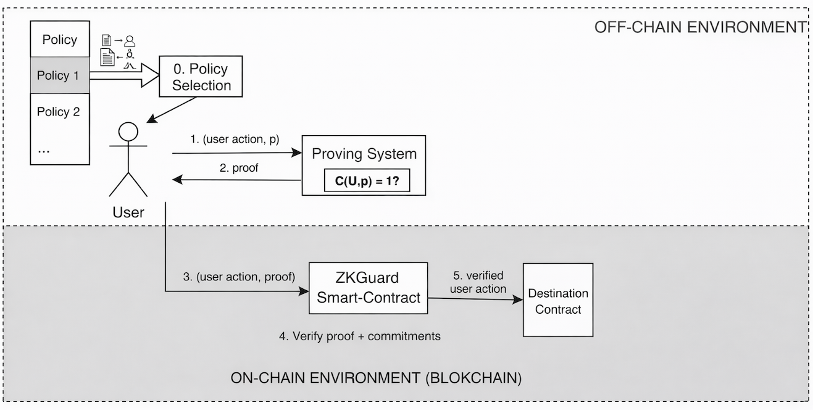

## title: "Verifiable Computation as a Protection System for Digital Wallets"
date: "2026-04-19T20:58:42.514Z"
description: "How to use VC to protect digital wallets with ZKPs"

*Special thanks to [Galexela](https://github.com/Alessandro-Cavaliere) for feedback and review*

## Introduction

Digital wallets are the primary way of interacting with blockchains. They hold assets, govern treasuries, execute upgrades, and increasingly serve as the operating layer through which users, companies, and systems interact with smart contracts. Yet most wallets still rely on signature verification to authorize any action. In many cases, multi-sig wallets are the norm: $m$-of-$n$ schemes exist and provide more security than a single key, but they still allow any action as long as the required signatures are provided.

Valid signatures tell us that a key approved a payload. They do not tell us whether the payload should have been allowed in the first place. If a signer is socially engineered, a device is compromised, or someone makes a mistake, the system has no way to distinguish between "the owner signed" and "the owner signed **an allowed action**". For projects, operational wallets, agent-controlled accounts, and high-value users, this is not enough. As attackers grow more sophisticated, these issues lead to incidents such as the [ByBit attack](https://www.csis.org/analysis/bybit-heist-and-future-us-crypto-regulation), the [Drift Protocol Hack](https://www.chainalysis.com/blog/lessons-from-the-drift-hack/), and even events like the [Paxos 300T minting mistake](https://www.cnbc.com/2025/10/16/paypals-crypto-partner-mints-300-trillion-stablecoins-in-technical-error.html). All of these show that operational security and a reliance on simple digital signatures are not enough.

The deeper issue is that a private key is an identity primitive, not an authorization one. It can tell us who signed, but it cannot tell us whether the signed action should be allowed. This is where verifiable computation offers an interesting solution: authorize the action with a private key and prove that the action satisfies a policy. To verify this succinctly and privately, generate a zero-knowledge proof and verify it on-chain. Now, when the action is performed, you do not just know that it is authorized. You also know it is compliant with your policy.

## From key custody to policy-constrained authorization

In the model implemented by [zkguard](https://github.com/ziemen4/zkguard), the wallet commits on-chain to a predefined policy set, for example through a Merkle root. The actual policy, meaning what the wallet can or cannot do, remains off-chain. Only a hiding commitment is stored on-chain. When a user wants to perform an action, the prover generates a zero-knowledge proof showing that a valid policy for the stored commitment exists in the policy set and that the proposed action is compliant with that policy. The verifier does not need to inspect every rule, and it does not need to learn which rule matched. It only needs to verify a succinct proof that attests to compliance.

This has an important consequence: the private key is no longer the single source of authority. It is one part of a larger authorization relation. The wallet accepts an action only if two things are true at the same time: the signer is legitimate, and the action is policy-compliant.

But we can do better. Once policy becomes first-class, hierarchical wallets emerge naturally. They are also more powerful because each policy can require more than one signature depending on the action. A small transfer might require a single signer, while a governance upgrade or recovery flow might require many.

This is much closer to how real institutions think about security. Different actors are assigned distinct roles, and each role can execute different actions. Since these actions carry different risk, they should require different conditions.

## Why privacy and succinctness matter

There may be cases where a public policy is acceptable, mainly for transparency. In many realistic settings, however, it leaks operational structure that should not be given to an adversary. A public policy can reveal who the signers are, which destinations are trusted, how upgrades are approved, or whether there are recovery paths, among other things. Even if the policy is sound, exposing it can make attacks easier and allow attackers to reason about how the wallet's operational security works.

Zero-knowledge allows the verifier to learn that the action is compliant with a policy without learning the internal structure of the policy or any other policy in the set. The system enforces rules without advertising them.

Succinctness is also important. If proofs were not succinct, whatever the prover did would have to be recomputed by the verifier. In fact, there are proving systems that allow for constant verification cost, no matter how much work the prover did!

[https://eprint.iacr.org/2016/260.pdf]. Since execution on-chain is generally costly, this makes the scheme practical by keeping proofs small enough to verify efficiently.

The combination of these properties yields a private policy system with public verifiability. It can enforce complex internal rules while exposing only a short cryptographic proof that allows the action to be executed. If the system is built properly, the main weak point moves away from raw secret custody and toward policy quality, proving system correctness, and policy-update governance. This is still a hard problem, but it is much better than the status quo.

## Does this actually work in practice?

For institutions, I believe the answer is already yes.

Today, with good prover hardware and mature proving systems, this model is already practical. Circuit-based systems such as Noir with UltraHonk and Gnark with Groth16 can be advantageous for simple use cases like transfers, issuance, and simple smart contracts. In contexts where operations are high volume and security is critical, additional prover overhead may be worth it.

There is also a broader design space. If proving latency becomes the main bottleneck, one can invest more in proving infrastructure or optimize circuits more aggressively. If local proving is inconvenient, [delegated or distributed proving can help](https://taceo.io/)

For more complex policies, zkVM-based systems may be slower today, but they offer a much more natural programming model. As zkVM performance keeps improving, they will become a very compelling option.

## Future directions

One of the most interesting open questions is what happens when we treat policy updates themselves as part of the attack surface. In [zkguard](https://github.com/ziemen4/zkguard), we treat policy updates **as part** of the policy, which is helpful because the weakest link is kept private. Nevertheless, there may be avenues for improvement. For example, requiring zero-knowledge proofs for policy updates such that any new policy must satisfy a baseline safety relation. This could prevent situations like allowing a policy with no signers or failing to cap the maximum amount for any policy. It would not solve every problem, but it would make one important class of dangerous updates cryptographically impossible.

Another direction is to bring machine learning into the authorization loop. In the current implementation, compliance is decided by a fixed rule system: amounts, destinations, selectors, and so on. But one can imagine augmenting this with a committed anomaly detector or risk model. A transaction may be valid under the policy set, but still anomalous in context. The model parameters could be committed and inference proved in zero-knowledge. This connects naturally with verifiable ML. I wrote previously about it in [AI alignment through programmable cryptography](https://ziemann.me/ai-crypto/). The broader idea is that you can commit to a model and later prove that a particular inference was produced by it, without exposing internal details. For wallet security, this could open the door to private anomaly detection as part of authorization.

Beyond that, there is plenty of room for the system to grow. First, the circuits are completely unoptimized, and the proving cost can almost certainly be reduced. Second, there are more mitigations to add: timelocks, expirations, rolling quotas, among others. Transparent and plausibly post-quantum proof systems remain an important long-term direction, especially because Groth16 is the most efficient way to verify on-chain but would not be sound in a post-quantum world.

All of these directions point to the same conclusion: this is not just a better multisig. It is the beginning of a different way to think about wallet security.

## Conclusion

In an adversarial world, leaving all security to a single private key is no longer an option. For many use cases, one can determine whether a payload must be authorized by verifying it directly. Other solutions are either public, which leaks authorization details, or too costly, since on-chain execution is not cheap. Verifiable computation changes this. We can have a private, succinct verification system that is cryptographically sound, so that any action a wallet attempts is always authorized by a predetermined policy.

This new paradigm will change how we secure digital assets. In a world where state-level actors are active, organized cybercrime is industrialized, and AI agents can scan and exploit systems at machine speed, trust and privacy are under pressure. Cryptography is offering a solution, and we should take it if we want this industry to succeed.