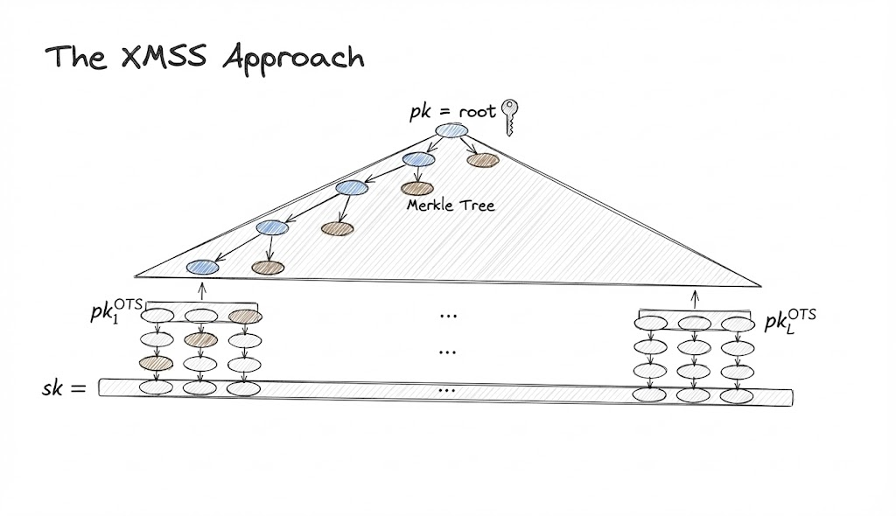

## Introduction
Ethereum today relies on BLS signatures for attestations. These are compact, aggregatable and battle-tested yet they are built on elliptic-curve assumptions which means that they are **not** post-quantum secure. 
[Lean Ethereum](https://leanroadmap.org/) is an experimental roadmap that is aggressively simplifying the base layer and, in one of its tracks, moving to a post-quantum secure Ethereum setup. In that world, XMSS style signatures become one of the main candidates to replace the existing BLS signatures.

In this post I want to walk through the XMSS signature scheme and how it is adapted for LeanSig, the proposed signature scheme for Lean Ethereum. Mostly I will be trying to convey the information in [this paper](https://eprint.iacr.org/2025/055) and trying to explain it as best as I can. The goal is to go through these ideas:
- How XMSS roughly works
- The notion of incomparable encodings
- Building a generic protocol to verify signature aggregation via a succinct argument system
- A nice optimization trick to make signature verification super efficient.

## XMSS Signatures

XMSS is a hash-based signature scheme that is designed to be post-quantum secure. It's based on two things:
1. A One Time Signature (OTS) scheme ([Winternitz]()) built from hash chains.
2. A [Merkle Tree]() that bundles many one-time public keys into a single one.

We start with $L$ one-time keypairs $(sk_{l}, pk_{l})$. Recall that for each $l$, the secret key is a vector: $sk_l = (sk_{l, 1}, \dots, sk_{l, v})$ and each component defines one hash chain. The corresponding public key $pk_l = (pk_{l, 1}, \dots, pk_{l, v})$ consists of the result of repeatedly hashing $sk_{l,i}$, meaning that for each component $i$: $pk_{l,i} = H^{2^w-1}(sk_{l,i})$

The idea is as follows:
- For each pair, define $pk_l$ as a leaf in a Merkle Tree. After all leaves are defined, construct the tree.
- The Merkle Root acts as a public root such that one can always show (via a Merkle Proof) that some $pk_l$ is part of the public root $pk_R$

Now we need the Winternitz-OTS scheme, which works as follows:
- To sign a message $m$ use a one time secret key $sk_l$ to produce a $OTS$ that reveals some information to the Verifier, in order to reconstruct the corresponding one time public key $pk_l$
- Then, attach a Merkle Proof that shows $pk_l$ is a leaf in the Merkle Tree with root $pk_R$

The idea is that hashes are one-way functions and therefore one cannot efficiently obtain $sk_l$ from $pk_l$. It's important to note that each key should only be used once.

The signature scheme basically consists of two algorithms, signing and verifying. The signing algorithm would work as follows:
1. To sign a message $m$, first one encodes the message $m$, with randomness $\rho$, into a vector $x = (x_1, ..., x_v) \in \{0, ..., 2^w - 1\}^v$
2. Afterwards we use $x$ as the **steps to take** in the hash-chain. So signing involves:
	- Converting $m$ to $x$ and
	- Hashing $x_i$ times for each component of $sk_l$ (which is also decomposed in $v$ values).

Where $v$ is the number of hash-chains and $w$ is the Winternitz parameter (bit-width). Each chain has length $2^w$. The value $\sigma_{OTS} = (H^{x_1}(sk_{l, 1}), ..., H^{x_v}(sk_{l, v}))$ accompanied by the Merkle Proof $\theta_l$ is the signature over the message $m$ 

*XMSS Approach based on [this]() presentation given in the Ethereum PQ workshop*

Verification of a signature, would involve the following steps:
- Recompute $x$ from the message $m$
- For each $\sigma_{OTS, i}$ complete the hash-chain by hashing the remaining $2^w - x_i - 1$ steps, until reaching $pk_l = H^{2^w - 1 - x_i}(\sigma_{OTS, i})$
- Finally, verify that $pk_l$ is included in the $MT$ with root $pk_R$

## Parameters
Before diving into what folks working in Lean Ethereum did, I want to give a picture of what happens when you change the parameters in this scheme.
The two most important parameters are $v$ (the number of hash-chains) and $2^w$ (the number of steps from $sk_l$ to $pk_l$). They both target different issues:
1. The number of hash chains $v$ is important to prevent collision resistant encodings of messages. If there are multiple messages that map to the same encoding, then the scheme is not **binding**, since one could potentially find that the same signature could be used for different messages.
2. The number of steps $2^w$ is important to prevent pre-image attacks. If an attacker can effectively reverse a hash-chain, it might find $sk_l$, breaking the security of the scheme

The signature size is: $(v + log L) \cdot w$ while the work that the prover and verifier **together** must do is $v \cdot 2^w$. Note that in a blockchain context we want both small signatures **and** fast verifiers.

## Incomparable encodings
The notion of incomparable encodings is important in order to create a scheme where we can't create signatures for messages $m$ if we don't know the secret key $sk_l$

***Def.*** Comparability: Two different codewords $x$ and $x'$ are said to be comparable if one dominates the other coordinate wise, that is if:

$$
	x_i \leq x'_i \text{ for all } i \text{ and } x_j \lt x'_j \text{ for at least one } j
$$
For example $(1, 2, 3)$ is comparable with $(2,3,4)$ or $(1,2,4)$ but it's incomparable with $(1,2,1)$ or $(1,2,3)$
The idea is to find an encoding function $IncEnc(P, m, \rho, l)$ that gives **incomparable codewords** from a message $m$. Having incomparable codewords means that the protocol is secure.
The reason for this is that whenever we get an encoding $(x_1, ..., x_v)$ from a message $m$ we are effectively getting the number of steps to hash on every chain. If there is at least one message $m'$ such that its encoding is **comparable** then we **could** generate a valid signature without knowing the secret key, just by continuing to hash from a known encoding $x$

*Encoding of messages $m$ and $m'$ where the encoding of $m'$ can be constructed solely based on the encoding of $m$ and not based in the values of $sk_l$*

Therefore, to prevent this from being able to happen, one needs to generate an **incomparable encoding** such that producing $x'$ is simply not possible.
### Achieving incomparability
In order to achieve this property and ensure the signature scheme is secure, one needs to propose an encoding that never allows this to happen. Note that we only need **one** hash-chain to have an element that is less than an existing one, that would be enough to prevent any issue from happening since reversing a single hash (with a secure hash function) is not feasible.
The easiest way to go about this is to add a new value to the code which we would call a *checksum*. The checksum would basically be $\sum_{i = 1}^v (W_{max} - x_i)$

Here $W_{max} = 2^w - 1$ which is the maximum possible value that any $x_i$ could take 

Note that this would add more elements to $x$ (increasing the signature size) but would always provide an incomparable encoding because of the fact that $x > x'$ if and only if $x_i \geq x'_i$ for all $i$ and $x_j \gt x'_j$ for at least one $j$. 
Sounds familiar? It is the definition of comparability we just gave before! Hence, whenever we had an encoding dominating another one, the checksum part would always turn up to be less, simply because:

$$
v \cdot W_{max} - \sum x_i \gt v \cdot W_{max} - \sum x'_i
$$
as long as $x > x'$ component-wise.

There is a better way to do this which does not increase signature size called Winternitz Target Sum. Here, instead of appending the checksum to our signature, we simply would add an extra-check to the verification phase:
- Whenever you get $x$ verify that: $\sum_{i = 1}^v x_i = T$

Where $T$ is a fixed parameter. Intuitively this works because of the same reason as before. If one were to obtain some $x > x'$ component-wise then the sum of its components **will be** greater and therefore will be at least $T + n$ with $n \gt 0$. This not only allows to discard the checksum as part of the signature but also is great for an optimization that we'll discuss later.

## LeanSig
Now we are ready to talk about *LeanSig*, the new construction that is based on these ideas and will be used to replace BLS. Ethereum requires attestations from validators once per epoch, therefore, each keypair will be used to attest in an epoch.

The idea is that each validator, when joining the network, generates keys for a number of epochs in advance. The amount of epochs is still not defined, but should be enough to last multiple years, or even decades.

### Key Generation
Let $L = 2^h$ be the number of epochs, then the algorithm works as follows:
1. Sample a random public salt $P$
2. For each epoch $ep$:
	- Choose random secrets $sk_{ep, i}$
	- Compute the public value by running the chain to the end of its range ($2^w - 1$)
		- $pk_{ep, i} := H^{2^w-1}(sk_{ep, i})$
	- Define $pk_{ep} = (pk_{ep, 1}, ..., pk_{ep, v})$ and $sk_{ep} = (sk_{ep, 1}, ..., sk_{ep, v})$
3. Place each $pk_{ep}$ as leaves of a Merkle Tree and compute the root $pk_R$

The public key is $pk = (pk_R, P)$
### Signing
In order to sign a message $m$ at epoch $ep$ with secret key $sk_{ep}$:
1. Generate the Merkle Proof $\theta_{ep}$ from $pk_{ep}$ to $pk_R$
2. Encode the message using an incomparable encoder: $x = \text{IncEnc}(P, m, \rho, ep)$ where $\rho$ is a fresh random value. 
	- Note that $\text{IncEnc}$ is randomized and _fallible_: the signer keeps sampling new $\rho$ values until the resulting vector fulfills the target-sum condition. This makes signing more expensive but results in cheaper verification.
3. For each $i$, compute $\sigma_{OTS, i} := H^{x_i}(sk_{ep, i})$
4. Set $\sigma_{OTS} = (\sigma_{OTS, 1}, ..., \sigma_{OTS, v})$

The final signature is:
$\sigma = (\rho, \sigma_{OTS}, \theta_{ep})$
### Verification
Given a public key $(pk_R, P)$, an epoch $ep$, a message $m$ and a signature $\sigma$ the verifier:

1. Recomputes $x = \text{IncEnc}(P, m, \rho, ep)$ from the message $m$ and randomness $\rho$
2. Checks that $x$ is a valid element in the code (via Winternitz Target Sum)
3. For each $i$, finish computing the hash-chain: $pk_{ep, i} = H^{2^w - 1 - x_i}(\sigma_{OTS, i})$
4. Set $pk_{ep} =(pk_{ep, 1}, ..., pk_{ep, v})$

Finally, the verification only needs to check if $\theta_{ep}$ is the Merkle Path from $pk_{ep}$ to $pk_R$ to be done.

## From many signatures to a single proof

So far we have only seen how a single validator produces a single *LeanSig* for a message $m$ at epoch $ep$. But we are really looking for an aggregated signature where:
- We have $k$ validators, each with a public key $pk_{ep}$
- They all sign a message $m$ at the same epoch $ep$
- We are looking for a single object convincing us that **all signatures** are valid.

We won't get into the entire aggregation approach, but rather talk about how to generalize it to a statement that can be later used by any proof system to prove this.
Let's define a relation $\Gamma$ that captures that "all signatures are valid". We can define that as:
- The statement: $x = (k, ep, m, \{pk_i\}_{i=1}^k)$
- The witness: $w = \{\sigma_i\}_{i=1}^k$

Where recall that $\sigma_i$ would be the signature that each validator generated. Thus, the relation $\Gamma$ holds if and only if:

$$
\forall i \in \{1, ..., k\}: \text{LeanSig.Ver}(pk_i, ep, m, \sigma_i) = 1
$$

> *Note: LeanMultiSig won't involve only aggregating signature verification, but also aggregating aggregation proofs. For simplicity, we will only talk about signature verification here. For the full aggregation protocol, see [this](https://ethresear.ch/t/post-quantum-signature-aggregation-a-folding-approach/23639) post on folding-based post-quantum signature aggregation.*

That is, that for all validators, the verification of the signature passes. Now take any SNARK where we define $\text{ArgProve}$ and $\text{ArgVer}$ as their proving and verification algorithms, then we can define the *LeanMultiSig* scheme as follows:

### Key Generation and Signing
Both key generation and signing are the same as in *LeanSig* since nothing else is required.
### Aggregation
To aggregate, given $ep$, $m$ and the list $( \{pk_i\}_{i=1}^k, \{\sigma_i\}_{i=1}^k )$
- Construct $x$ and $w$ as explained before
#### Proving
- Compute the aggregated signature as the proof $\pi = \text{ArgProve}^H(x, w)$ where $H$ is the random oracle used by the SNARK implementation.
#### Verifying
- Given the list of public keys $\{pk_i\}_{i=1}^k$, the epoch $ep$, message $m$ and the proof $\pi$ run:
	- $b := \text{ArgVer}^H(x, \pi)$ and verify that $b = 1$

Instead of verifying $k$ separate hash based signatures, the protocol only needs to verify a single succinct proof. The cost of validation is decoupled from the number of validators and tied instead to the cost of running the proving system itself.

## A geometric detour: layers in a hypercube

The follow up paper [_At the Top of the Hypercube_](https://eprint.iacr.org/2025/889.pdf) digs into a very specific but important question:

> How should we choose the codewords $x$ in order to get the best tradeoff between signature size and verification time?

The idea is as follows: Since verifying signatures is what we will have to do in the Verification Algorithm of our proving system, can we make the verification very fast while keeping the signature size small? In other words, could we encode in a way where the signer makes most of the work but without requiring us to decrease the number of hash-chain steps $2^w$?

The answer is yes! By forcing the encoding to lie in the top layers of the hypercube (very close to the chain ends), we force the signer to do the heavy lifting (hashing many times), while the verifier only needs to compute a few remaining hashes.

To understand it, we need to get a more proper intuition of the problem. So, consider all the possible codewords as points in a $v$-dimensional grid: $\{0, 1, ..., N - 1\}^v$ where $N = 2^w$

For reference, a value may be $11 \dots 1$ where $1$ is repeated $v$ times.
The idea is that there is a directed edge from a point $x$ to a point $y$ if:
- For some $i$, $y_i = x_i + 1$ and $x_j = y_j$ for all $j \neq i$

So, for instance if we have $x = 11 \dots 1$ and $y = 21 \dots 1$ then since $y_1 = x_1 + 1$ but $x_j = y_j$ for all $j \neq 1$ we would have a directed edge from $x$ to $y$

TOOO: -- Add 2D Diagram traversing with arrows

Note that if we count the distance from each point to the "sink" $(N-1, N-1, \dots, N-1)$ we start seeing layers at the same distance, and importantly two properties hold:
- Points in the same layer turn out to form an **incomparable set** under the coordinate wise order that we care about. Since they are the same distance away, the sum of their components is always a constant $T$, which complies with the Winternitz Target Sum we saw before.
- The value $x_i$ directly controls how many hashes the signer does and therefore, if we could always get an encoding on one of the top layers, the verifier will have very little work to do.

The paper then proposes different encoding schemes that **massively improve** the verification cost when compared against existing schemes, the idea is to use one of those encoding functions as $IncEnc(P, m, \rho, l)$

> *Note: This encoding is currently state-of-the-art in the spec, but it turned out to be unfriendly for SNARK implementations (because of big-integer arithmetic), and ongoing work is exploring alternatives. It might not be the encoding used in the final design.*

## Why this matters for Ethereum

Quantum computers threaten elliptic curve based signatures like BLS, but hash-based signatures tend to be bigger in size and compute. Ethereum is a p2p network with big constraints on bandwidth usage; Therefore, new research is required in order to create implementations that can provide good alternatives.

The *LeanSig* proposed design improve existing constructions by:
- Optimizing the generalized XMSS signatures with incomparable encodings that are cheap to verify and do not worsen the signature size
- Create a generic statement that can be proven by a specialized argument system in order to aggregate each validator signature

There is also work done on the aggregation part regarding the concrete proving system to use for *LeanMultiSig*, though that is a discussion for a future post.****