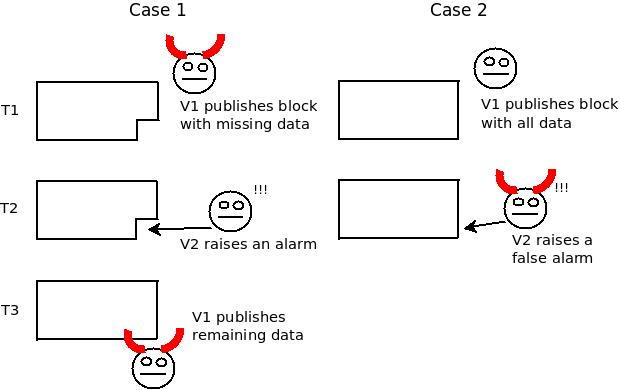
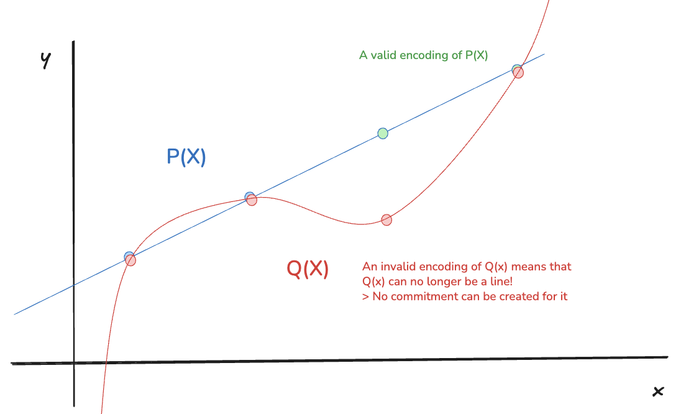

---  
title: "The Rise and Fall of the Data Availability Problem"
date: "2025-09-14T09:27:45.934Z"  
description: "The history behind the Data Availability Problem and its groundbrekaing solutions"
---
*Special thanks to [Abhi](https://www.thebookofzk.xyz/) and [Alex](https://x.com/alexhooketh) for feedback*

## Introduction
While the theory behind the Data Availability (DA) problem has been discussed for years, **these are the years we can start seeing solutions become a reality** on the Ethereum network. And while **there are** some very good explainers about it, like [this](https://ethereum.org/en/roadmap/danksharding) or [this](https://a16zcrypto.com/posts/article/an-overview-of-danksharding-and-a-proposal-for-improvement-of-das), I want to try to journey through the original problem and the ingenious solutions that were found and not delve so much on the details of it all.

You may have heard of the **Dencun** upgrade where EIP-4844 (Proto-Danksharding) was launched, creating [_blobs_](https://mirror.xyz/alexhook.eth/W4PYt5zGWjw9VcB8Z6KIJDoyCU0RPA1d304cM0J75mQ). **In May 2025 the combined Prague–Electra (“Pectra”) upgrade went live**; looking ahead, [PeerDAS](https://ethresear.ch/t/peerdas-a-simpler-das-approach-using-battle-tested-p2p-components/16541) (EIP-7594) is planned for the **Fusaka** upgrade. Ethereum is laying the foundations for a scalable blockchain and the Data Availability Problem (DAP) is at the centre of it.

My goal here is not to provide a specific post talking about how DAS is being implemented, but rather to discover how the problem first came to be, how it was formulated and what the solutions to it are. It's a more general description rather than a specific one.

## The Rise of the Data Availability Problem
I want to take you back to 2018, when the DA problem was [first formulated](https://github.com/ethereum/research/wiki/A-note-on-data-availability-and-erasure-coding).
The issue Ethereum was trying to solve back then was the security asymmetry between light clients and full nodes. On the single L1 chain, there were two types of nodes:

1. **Full nodes,** which download all proposed blocks and execute all transactions.
2. **Light nodes,** which simply download block headers.

With that in mind, think about state correctness. For full nodes, it's simple: they re-execute every transaction, so they can verify the state transition is valid. Light nodes, however, only see the headers, so they can't know if an invalid transaction is hidden inside a block. The proposed solution was to have full nodes create and broadcast [**fraud proofs**](https://dankradfeist.de/ethereum/2019/12/20/data-availability-checks.html) for incorrect state transitions. With a $1-$of$-N$ honesty assumption (you only need one honest full node to act), light nodes could be alerted to invalid blocks.

But an issue remains! Here is the "data availability problem":
1. A malicious block producer publishes a block header and propagates it **BUT**...
2. The block producer withholds a portion of the block data.

Since a portion of the block is withheld, honest full nodes can't generate a fraud proof. Their only option is to raise an alarm, stating that a part of the block is missing. But here comes the core issue: **ambiguity**.

Imagine a full node $A$, raises an alarm: "I'm missing chunk 42!". The malicious producer can immediately broadcast chunk 42. Another full node, $B$, might receive chunk 42 _first_, and then see $A$'s alarm. From $B$'s perspective, $A$ is the lier launching a DoS attack. There is no way for the network to reliably agree on who was malicious. This makes any reward or slashing system based on alarms impossible to implement.

*A representation of the DAP as originally defined by Vitalik Buterin (Source: [post](https://github.com/ethereum/research/wiki/A-note-on-data-availability-and-erasure-coding))*

## A potential solution: Data Availability Sampling
To solve this, one idea is to have light clients download small, random parts of the block. If enough honest light clients exist, and they each successfully download different sections, we can be statistically confident the whole block is available. However, a malicious producer could withhold just a few bytes, and most samplers would miss it, erroneously thinking the block is fine.

This leads to a more interesting idea: force the block producer to add redundancy using **erasure coding**. This process extends the block from $M$ original chunks to $N$ total chunks (where $N \gt M$). The key property is that you can reconstruct the original $M$ chunks from **_any_** $M$ of the $N$ chunks.

There are plenty of erasure codes, and one that is widely known is the **Reed-Solomon (RS)** code**.​ In particular, one can build **Reed-Solomon codes** by starting from the coefficients of a polynomial (the *message*, of length $M$) and evaluating it at $N$ positions, treating that process as the *encoding* of the message, and obtaining a *codeword* of length $N$. There is also a subtle way of doing something very similar by taking the *message* to be the first $M$ evaluations of the polynomial on a fixed set of points and then evaluating it on $N-M$ additional points. This is typically called the **univariate low-degree extension** or LDE of a polynomial, and importantly it is useful to encode our original data since it has the same properties as the RS code does, it allows us to reconstruct the original data from any of the $M$ points.

>"**A note on terminology.** In the coding theory literature, $a$ is referred to as a *message* and the encoding $LDE(a)$ is called the *codeword* corresponding to message $a$. Many authors use the term Reed-Solomon encoding and low-degree extension encoding interchangeably. Often, the distinction does not matter, as the set of codewords is the same regardless, namely the set of all evaluation tables of polynomials of degree at most $n−1$ over $\mathbb{F}_p$. All that differs between the two is the correspondence between messages and codewords. i.e., whether the message is interpreted as the coefficients of a polynomial of degree $n − 1$, vs. as the evaluations of the polynomial over a canonical set of inputs such as $\{0,1,...,n−1\}$." *[Proofs, Arguments and Zero-Knowledge by Justin Thaler](https://people.cs.georgetown.edu/jthaler/ProofsArgsAndZK.pdf)*

If you are interested in understanding it more in-depth, I advise you to read Section 2 on [Thaler's masterpiece](https://people.cs.georgetown.edu/jthaler/ProofsArgsAndZK.pdf). For now, this is enough to continue with our explanation.

Let's break down how we turn block data into a polynomial, assuming a 2-fold extension (meaning $N=2M$, or $k/n=1/2$, also known as the code's "rate"):

1. **Chunk the Data:** We take our block data and split it into $k$ chunks, let's call them $c_0​, c_1​, ..., c_{k−1​}$
    
2. **Interpret them as Points:** We treat each chunk as the $y$-value of a point on a 2D graph. We can say chunk $c_0$​ is the point $(0, c0​)$, chunk $c_1$​ is $(1,c_1​)$, and so on, up to $(k−1,c_{k−1​})$
    
3. **Find the Polynomial:** A fundamental mathematical principle states that there is exactly one unique polynomial of degree less than $k$ that passes through these $k$ points. We can find this polynomial by using [Lagrange Interpolation](https://mathworld.wolfram.com/LagrangeInterpolatingPolynomial.html), let's call it $P(x)$.
    
4. **Extend the Data:** Now, we "extend" our data by simply evaluating this same polynomial at new $x$-coordinates. We calculate $P(k), P(k+1), ..., P(n−1)$. These new evaluations are our redundant chunks. Since the polynomial is uniquely defined by $k$ points, having more of them allows us to use *any* $k$ out of the now $n$ evaluations to obtain the polynomial back, and hence the original $M$ chunks.

Now that we have the extended block and light nodes can sample it. Let's go through some cases:
#### 1. The block proposer extended the block correctly
The producer correctly applied the erasure coding. Now, if they want to withhold even a small piece of data, since there are enough chunks to reconstruct the whole block (recall that with **any** $M$ chunks we can reconstruct $N$ chunks) then there is no point in them doing so! To pull it off, they must withhold (assuming the same 2-fold extension that we discussed before) **at least half of the data**.

If a single light client samples just 10 random chunks, the probability of them _missing_ the withheld data is $(\frac{1}{2})^{10}$, which is less than 0.1%. With hundreds of clients sampling, it becomes a statistical certainty that the fraud will be detected.

#### 2. The block proposer did not extend the block correctly
Here lies the problem. What if the producer creates the extended data with garbage values that don't follow the polynomial? Then everything we discussed before simply does not hold anymore!

Original proposals defined specialised fraud proofs to show that the extended block was incorrectly generated. Though some [research](https://arxiv.org/pdf/1809.09044) was done for such a scheme, fraud proofs were still not good enough in terms of size and overall complexity. Therefore there seemed to be no efficient way to solve the problem! Luckily, there is a clever solution involving polynomials.

## The fall of the Data Availability Problem: PCS
A **Polynomial Commitment Scheme (PCS)** is a cryptographic tool that allows someone to create a short, cryptographic commitment for a polynomial with two key properties:

1. **Binding**: The commitment is uniquely tied to one specific polynomial.
2. **Evaluation Proofs**: The prover can evaluate the polynomial at any point $x$ such that $p(x)=y$ and produce a proof $\pi$ that anyone can verify using just the commitment, the point $x$, and the claimed value $y$.

Thus, the solution is to force the block producer to _commit_ to their polynomial beforehand and then ensure that each sample we take is from that specific polynomial! The specific PCS used by Ethereum is called **[KZG](https://www.iacr.org/archive/asiacrypt2010/6477178/6477178.pdf) (Kate-Zaverucha-Goldberg)**. In everyday terms: a PCS is like sealing your data (encoded as a polynomial) in a tamper-evident envelope that also lets you prove what the value is at any input without opening the whole thing.

You may already be familiar with a widely popular commitment scheme used in blockchains: Merkle Trees! They allow one to generate a commitment (a Merkle Root) and provide the value at any point with an opening proof (the leaf value with a Merkle Proof). The key difference with respect to a PCS is that these exclusively encode **a polynomial** (with polynomial evaluations) and not just *any* set of data. Since *blobs* effectively **are** polynomials, this is a perfect fit!

This scheme elegantly solves our problem by making bad encodings impossible to prove. Let's look at the two ways a malicious producer could try to cheat:

#### Attack 1: Commit to the correct polynomial, but provide fake evaluation proofs.
The producer generates the correct polynomial $P(x)$ from the original data and publishes the commitment $C$. Now, a sampler requests the evaluation at point $j$, which is in the producer's secretly corrupted part of the extension. The producer can't just send back a fake value. They must provide the value _and_ an evaluation proof that links the value, the point $j$, and the original commitment $C$. Because the fake value does not lie on the committed polynomial $P(x)$, the PCS verification done by the light client using the evaluation proof $\pi$ fails and fraud is detected.

#### Attack 2: Create a malicious polynomial that matches the original data but diverges on the extension.
The producer tries to create a fraudulent polynomial $Q(x)$ that matches the real polynomial $P(x)$ on the first $k$ points (the original data), but gives different results for the extended data. They then publish a commitment $C_Q$​ to this fake polynomial.

Importantly, recall that a polynomial of degree $k-1$ is **uniquely defined by $k$ points**. Since both $P(x)$ and $Q(x)$ must have degree less than $k$ (a requirement of the PCS, since a commitment could not be created in any other case) and they must match on the first $k$ points (they represent the same original data), they **must be the exact same polynomial**. It is mathematically impossible for $Q(x)$ to be different from $P(x)$ at any point.

*A representation of how $P(x)$ and $Q(x)$ must be the same polynomial or a higher degree polynomial is required instead. **Polynomials are not up to scale***

In other words, if you imagine a polynomial $P(x)$ that is defined by two points, that would be a line. An attacker would use the same starting line (the original data), but try to encode it maliciously by giving other points that **are not** part of that line. Now that means that we have two polynomials $P(x)$ and $Q(x)$ that are uniquely defined by **two points**, thus they **must** have degree $0$ or $1$ (only possibilities that are strictly less than $2$), and if they do they **must** be the **same line** already determined by $P(x)$. Hence, if $Q(x)$ was wrongly encoded (by evaluating on a point that falls outside of the line), it would immediately be at least a degree $2$ polynomial (a quadratic function), and we cannot generate a valid commitment for said polynomial!

This is the magic of the PCS: **It makes the data self-authenticating.** A commitment to the first $k$ points is implicitly a commitment to all $n$ points of the correct extension. There is no longer a need for fraud proofs for bad encodings because a "bad encoding" with a valid commitment simply **cannot** be constructed.

### So what about light nodes?
The original Data Availability Problem was indeed about securing L1 light clients. However, in the years it took to research and develop a full DAS solution, two things happened:

1. A more immediate solution for L1 light clients was developed: [**Sync Committees**](https://github.com/ethereum/consensus-specs/blob/dev/specs/altair/validator.md#sync-committee). This provides a weaker security guarantee (trusting 2/3 of a 512-member committee) but was much faster to implement.
2. **Rollups emerged** as the primary scaling strategy for Ethereum, and they had a massive need for cheap, secure data availability.

Therefore, the powerful DAS + PCS machinery, originally theorised for light nodes, was repurposed to become primordial for rollup scaling. **[Danksharding](https://ethereum.org/en/roadmap/danksharding/) is part of the solution to the Data Availability Problem _for rollups_.**

## Conclusion
From a seemingly simple problem of securing light clients, we've journeyed through data sampling, erasure codes and commitment schemes. These lead to learning about powerful ideas such as the redundancy of erasure codes and the mathematics behind polynomials, bringing us closer to solving the DAP!

We are currently witnessing the rollout towards PeerDAS with the full vision of Danksharding as its culmination. These are the ideas that will allow Ethereum to scale while retaining its core security guarantees.