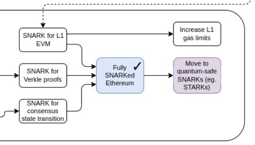

**Crypto is dead.**

That is the headline people want right now. You see it everywhere: prices down, volumes down, people leaving. The hype is gone. The easy money is gone.
And honestly, part of that is correct.

A version of crypto is dead: the version built on worthless tokens with no product, no users, and no value. The version that confused speculation for innovation, where launching a token was treated like shipping a company. The version where communities were often just exit liquidity.
That version needed to die. But we should not confuse the end of a phase with the end of a technology.

## What died?
During the last 10 years, we ran a giant global experiment. Some of it was ugly, some of it brilliant and innovative.
We tried things because we did not yet know what would work. We focused on a rollup-centric roadmap because base-layer scalability was not possible (not without losing what makes a blockchain important). That was not failure; that was engineering under constraints.

At the same time, programmable cryptography has accelerated faster than most expected. We thought some breakthroughs were far away, but in fact, they were not. The timeline was unclear, but not the direction.

*The Verge: SNARKifying Ethereum was always the goal (Source: [tweet](https://x.com/VitalikButerin/status/1588669782471368704))*

Now it's clear: ZK systems, better proving stacks, better execution designs, post-quantum schemes - [Lean Ethereum](https://leanroadmap.org/). The infamous blockchain trilemma is no longer a constraint; it's an engineering problem with real solutions.
This was always the bet: not if, but when.

## What really happened
If crypto is alive, where is it?
- It is in [payments that settle globally and fast](https://www.anchorage.com/insights/anchorage-apis-power-visa-crypto-native-settlement)
- It is in [stablecoins being used as real financial rails](https://www.circle.com/multi-chain-usdc/ethereum)
- It is in [on-chain credit and market structures that can be audited](https://etherscan.io/address/0x87870bca3f3fd6335c3f4ce8392d69350b4fa4e2)
- It is in [custody models where users can actually own assets through cryptographic keys](https://support.argent.xyz/hc/en-us/articles/360022517432-Does-Argent-have-access-to-my-funds)
- It is in [systems where rules are transparent, execution is deterministic, and settlement is programmable](https://docs.uniswap.org/concepts/uniswap-protocol)

Crypto is shifting to infrastructure.
That does not always feel exciting in the short term, because infrastructure rarely looks fancy while it is being built. The internet did not become powerful because dial-up was exciting. It became powerful because the rails got good enough for everything else to be built on top.
Crypto is going through a similar transition now.

## "The old crypto was more fun"
True.
The old crypto was more chaotic, more experimental, more community-native, more open-ended. Maturity always feels like a loss if your reference point is early-stage.
But this is what it looks like in every technology cycle. Institutions arrive. Compliance matters. Risk controls matter. Reliability matters.

That is not to say that crypto is completely mature; it's still in its early days, with finance as its primary use case. But crypto entails not only blockchains but also programmable cryptography, which, in my opinion, will play a huge role in the future (i.e., [AI alignment](https://ziemann.me/ai-crypto/), [privacy](https://aztec.network/), [trustless solutions](https://docs.taceo.io/), and [identity](https://world.org/world-chain)).

## Decentralization matters more now, not less
There is another misconception: as crypto institutionalizes, decentralization becomes optional.
It is the opposite.

The threat model is getting harder, not easier. State-level actors are active. Organized cybercrime is industrialized. AI agents can already scan, probe, and exploit systems at incredible speed. Identity can be faked. Signals can be manipulated. Trust and privacy are under pressure everywhere.
In that world, programmable trust is not a niche technology; it is a practical requirement.

- We need systems that are open, auditable, and censorship-resistant by design.
- We need formal verification where it matters most.
- [We need autonomous monitoring and defenses on live contracts.](https://github.com/ziemen4/zkpoex)
- [We need better cryptographic auth and stronger security primitives end-to-end.](https://github.com/ziemen4/zkguard)

To reach that world, we need scalable, reliable, and neutral blockchains.

## What Died, What Was Born
When a technology starts disappearing into the stack, that usually means it's being adopted.
So yes, a version of crypto died: empty tokens, attention loops, and the idea that price action alone is product-market fit.
What is being born is harder and more durable: compliant payment rails, programmable value, cryptographic self-custody, transparent settlement, and verifiable trust in adversarial environments.

If you came for another mania, this feels like an ending.
If you came for the long game, this is the beginning.

**Long live crypto.**
